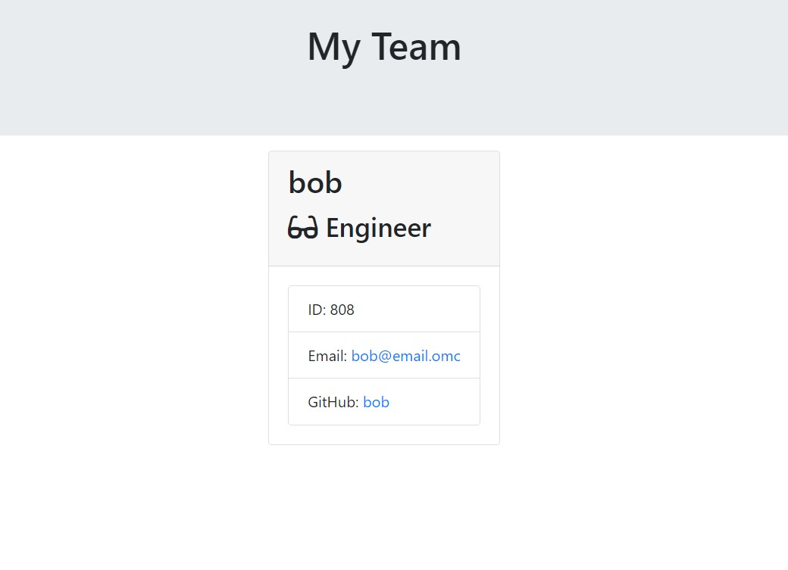

# Team-Profile-Generator

Having a team profile generator can be used to create a team portfolio. This can then be used by organisations, to assist in restructuring or creating communication channels. Furthermore, additional code can be added to this repository to include different roles. 

Installation requirements: inquirer, path, fs, jest

Link to watch demo:
https://docs.google.com/document/d/1qJaTDEOMhENs1-Dp-fVcWQC3xgWOyL1cXUf0BCbZB40/edit\

